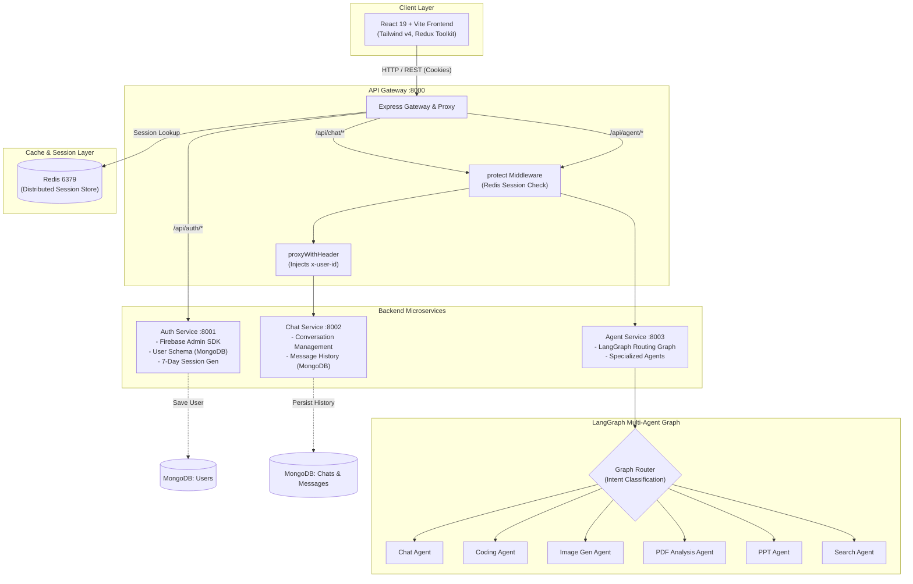

# Nexus Node ⚡

> **An event-driven, distributed multi-agent AI workspace designed for intelligent task orchestration and collaborative conversational workflows.**

[](https://nodejs.org)
[](https://expressjs.com/)
[](https://react.dev/)
[](https://tailwindcss.com/)
[](https://www.langchain.com/langgraph)
[](https://redis.io/)
[](https://www.mongodb.com/)
[](https://firebase.google.com/)
[](LICENSE)

---

## 📌 Overview

**Nexus Node** is a scalable, microservices-based AI platform that routes user inquiries to dedicated, specialized AI agents using a dynamic graph routing engine. Rather than relying on a single monolithic language model, Nexus Node distributes domain-specific tasks (general conversation, code synthesis, visual generation, document analysis, presentation building, and web search) across isolated agent nodes.

The system is decoupled into an **API Gateway**, independent **Domain Microservices**, a **LangGraph Agent Engine**, and a reactive **Vite + React 19 Frontend**.

---

## 🏗️ System Architecture



---

## 🧩 Current Implementation Status

Here is an exact, deep-dive summary of what is built and operating today versus what is being actively expanded:

### 1. Ingress & API Gateway (`/backend/gateway`)
- [x] **Reverse Proxy Integration**: Uses `express-http-proxy` to route requests transparently to respective microservices.
- [x] **Session Guard Middleware (`protect`)**: Verifies HTTP-only session cookies against Redis in real time before admitting requests to protected routes.
- [x] **Header Injection (`proxyWithHeader`)**: Extracts user credentials from Redis and automatically injects metadata (`x-user-id`) into downstream service requests.
- [x] **CORS & Cookie Parser**: Centralized cookie management and origin validation.

### 2. Auth Service (`/backend/services/auth`)
- [x] **Firebase Authentication Integration**: Validates Google OAuth ID tokens on the server using `firebase-admin`.
- [x] **User Sync & Persistence**: Automatically provisions and syncs user records in MongoDB upon successful token verification.
- [x] **Redis-Backed Session Management**: Issues UUIDv4 session identifiers stored in Redis with 7-day TTL and dispatches `httpOnly`, `sameSite: strict` cookies.
- [x] **Logout Invalidation**: Destroys session keys in Redis and clears browser cookies.

### 3. Chat Service (`/backend/services/chat`)
- [x] **Thread Management**: Endpoints to create, update (rename titles), and query user conversation lists.
- [x] **Message Persistence**: Schema for role-based (`user`/`assistant`) message logs mapped to `conversationId`.
- [x] **Chronological Retrieval**: Fetching message history sorted by creation timestamps.

### 4. Agent Service (`/backend/services/agent`)
- [x] **LangGraph Foundation**: Configured with `@langchain/langgraph` and `@langchain/core`.
- [x] **Agent Scaffolding**: Modular directory structure housing individual agent handlers:
  - 💬 **Chat Agent**: Conversational exchanges and dialogue management.
  - 💻 **Coding Agent**: Code writing, reviewing, and explanation workflows.
  - 🎨 **Image Gen Agent**: Prompt formatting and image generation pipelines.
  - 📄 **PDF Agent**: Document parsing, context retrieval, and question-answering.
  - 📊 **PPT Agent**: Presentation outlining and slide data structuring.
  - 🔍 **Search Agent**: Web search routing and retrieval-augmented context.
- [ ] **LangGraph StateGraph Execution**: *In active implementation* (conditional edge routing & graph compilation).

### 5. Frontend Client (`/frontend`)
- [x] **Stack**: React 19, Vite, Tailwind CSS v4.
- [x] **Authentication Flow**: Firebase Google popup sign-in integrated with backend `/api/auth/login`.
- [x] **State Management**: Redux Toolkit store (`userSlice`) tracking authenticated user state.
- [x] **Glassmorphic Dark UI**: Clean modal overlay with responsive design.
- [ ] **Chat Interface & Agent Viewports**: *In progress* (sidebar threads, streaming responses, agent selector).

---

## 📂 Repository Structure

```text
nexus_node/
├── backend/
│   ├── docker-compose.yml         # Container configuration (Redis)
│   ├── gateway/                   # Ingress reverse proxy & auth middleware
│   │   ├── controllers/
│   │   ├── middleware/            # Redis-based session protector
│   │   ├── utils/                 # Header injection proxy utilities
│   │   └── index.js
│   ├── services/
│   │   ├── auth/                  # Authentication & Firebase Admin service
│   │   │   ├── config/            # Database & Firebase initialization
│   │   │   ├── controllers/
│   │   │   ├── model/             # User Mongoose model
│   │   │   └── routes/
│   │   ├── chat/                  # Conversation & message storage service
│   │   │   ├── config/
│   │   │   ├── controllers/
│   │   │   ├── models/            # Conversation & Message schemas
│   │   │   └── routes/
│   │   └── agent/                 # LangGraph multi-agent orchestration
│   │       ├── agents/            # Individual specialized agents (chat, code, image, etc.)
│   │       ├── config/
│   │       ├── graph/             # Dynamic router & LangGraph execution
│   │       └── index.js
│   └── shared/
│       └── redis/                 # Shared ioredis client singleton
├── frontend/                      # Vite + React 19 Client
│   ├── src/
│   │   ├── features/              # Feature modules & user status
│   │   ├── pages/                 # Application views (Home, Chat, etc.)
│   │   ├── redux/                 # Redux Toolkit slices and store configuration
│   │   └── utils/                 # Axios client instance & Firebase SDK init
│   └── package.json
└── README.md
```

---

## 🛠️ Tech Stack & Tools

| Domain | Technology | Description |
| :--- | :--- | :--- |
| **API Gateway** | Express 5, `express-http-proxy` | Ingress traffic routing, centralized auth guard & header mutation |
| **Agent Framework** | `@langchain/langgraph`, `@langchain/core` | State-driven multi-agent graph orchestration |
| **Cache & Sessions** | Redis, `ioredis` | Fast key-value session storage with automatic TTL |
| **Database** | MongoDB, Mongoose | Document database for users, conversation threads, and message logs |
| **Auth** | Firebase Auth (Client & Admin SDK) | Google identity provider verification and account synchronization |
| **Frontend** | React 19, Vite, Tailwind CSS v4 | High-performance reactive UI with modern styles |
| **State Management**| Redux Toolkit (`@reduxjs/toolkit`) | Predictable global client state container |
| **Containers** | Docker Compose | Local Redis instance management |

---

## 🚀 Getting Started

### 1. Prerequisites
- [Node.js](https://nodejs.org/) (v18 or higher)
- [Docker Desktop](https://www.docker.com/) (for Redis)
- [MongoDB](https://www.mongodb.com/) (local instance or MongoDB Atlas)

---

### 2. Local Setup & Execution

1. **Start the Infrastructure (Redis)**:
   ```bash
   cd backend
   docker compose up -d
   ```

2. **Start the Backend Microservices**:
   Run each service in its respective directory:
   ```bash
   # Ingress API Gateway (Port 8000)
   cd backend/gateway && npm install && npm run dev

   # Authentication Service (Port 8001)
   cd backend/services/auth && npm install && npm run dev

   # Chat & Message Service (Port 8002)
   cd backend/services/chat && npm install && npm run dev

   # LangGraph Agent Service (Port 8003)
   cd backend/services/agent && npm install && npm run dev
   ```

3. **Start the Frontend Client**:
   ```bash
   cd frontend
   npm install
   npm run dev
   ```

Open `http://localhost:5173` in your browser to access the application workspace.

---

## 🗺️ Roadmap & Future Architecture

- [ ] **LangGraph Routing**: Compile conditional routing logic inside `backend/services/agent/graph/router.js` to dispatch queries based on intent detection.
- [ ] **Streaming Responses (SSE / WebSockets)**: Enable token-by-token streaming from individual agent models back to the client interface.
- [ ] **Multi-Agent Memory**: Implement LangGraph checkpointers backed by Redis/MongoDB for cross-turn contextual memory.
- [ ] **Document & Vector Ingestion**: RAG pipeline for the `pdf.agent.js` and `search.agent.js` using vector embeddings.
- [ ] **Rich Frontend Workspace**: Multi-view layout displaying agent thought processes, tool calls, and rendered output (markdown, syntax-highlighted code, image canvas).

---

## 📄 License

This project is licensed under the Apache License 2.0. See the [LICENSE](LICENSE) file for details.
